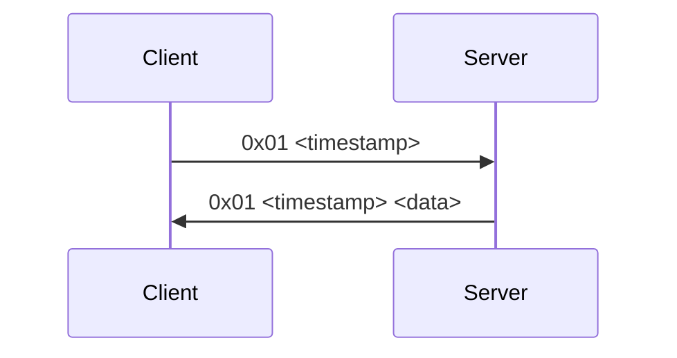
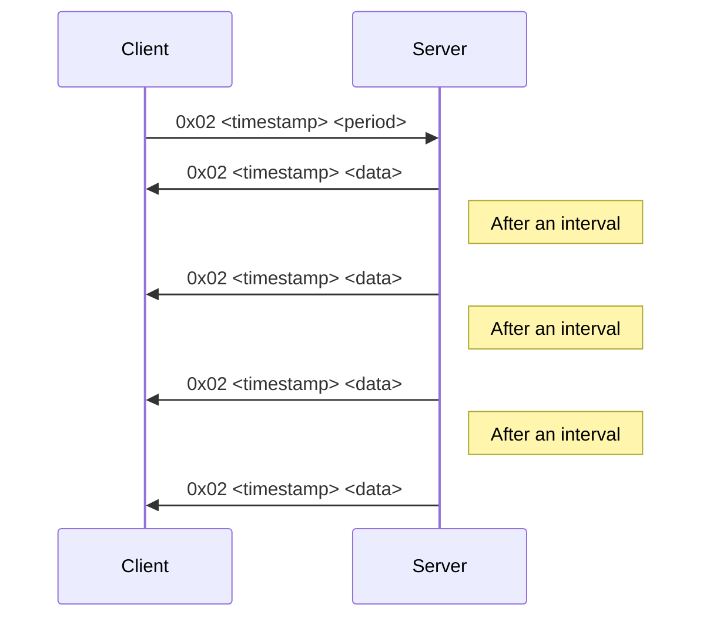

# Exercise project for university class "Operating Systems"

## Description
Projects consists of server and client applications along with a shared library. 

### Server 
`Server/`

Servers can be launched in 2 modes, each mode serves different information about the system:
 1. Serves processor architecture and logical cores count,
 2. Serves processor physical cores count and process modules count.

System information is provided by `Server.OSApi.OperatingSystemApi` class. This class have cross-platform implementations for Windows and Linux operating systems, so on Windows information is obtained via WinAPI functions calls.

Communication with clients is based on sockets.

### Client
`Client/`

Client is a console application accepting some parameters as command line arguments. It connects to specified server and requests information either once or periodically. `Client.Client` class essentially is a wrapper around socket.

### Shared library
`Shared/`

Shared library contains binary serialization tools and message codes.

### Messages

Client and server communicates via messages. Each message should have a header with message code and timestamp, and may have a body. There are only 2 message codes implemented.

Code `0x01` means single response from server:

Code `0x02` means periodic responses from server over specified interval in seconds:

